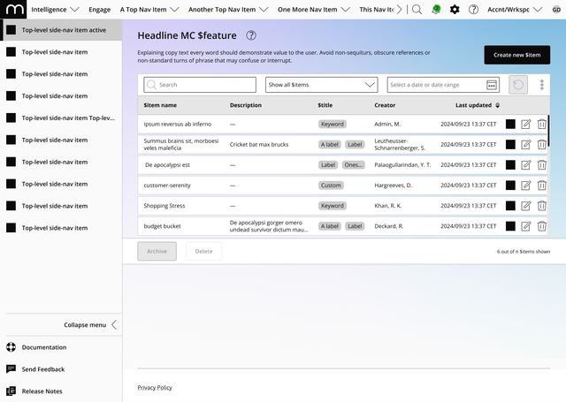

# LLM-Mail

An AI-powered email template editor for Mapp Engage users. Generate professional HTML email campaigns through natural language prompts using OpenAI GPT-4.



## Features

- **🤖 AI-Powered Generation** - Describe your email campaign in natural language, get professional results
- **📧 Mapp Engage Integration** - Automatic support for Mapp placeholders (`{{user.firstname}}`, `{{product.name}}`, etc.)
- **💾 Template Management** - Save, load, and reuse email templates with SQLite storage
- **🎨 Look & Feel Templates** - Store brand colors, logos, and fonts for consistent campaigns
- **👁 Live Preview** - See your email rendered in real-time
- **📱 Responsive Design** - Generated emails work across all major email clients (Gmail, Outlook, Apple Mail)
- **✏️ Editable Prompts** - Customize AI behavior through external markdown prompt files
- **💬 Conversational Interface** - Chat-based UI inspired by modern AI tools

## Tech Stack

### Frontend
- **React 19** - UI library
- **Vite 7** - Build tool and dev server
- **Tailwind CSS 4** - Utility-first styling
- **PostCSS** - CSS processing

### Backend
- **Node.js** - Runtime environment
- **Express 5** - Web framework
- **OpenAI API** - GPT-4o for content and HTML generation
- **SQLite** (better-sqlite3) - Database for templates
- **dotenv** - Environment configuration

## Architecture

```
┌─────────────────┐         ┌──────────────────┐
│  React Frontend │────────▶│  Express Backend │
│  (Port 5173+)   │◀────────│   (Port 3000)    │
└─────────────────┘         └──────────────────┘
                                     │
                            ┌────────┴────────┐
                            ▼                 ▼
                    ┌──────────────┐  ┌─────────────┐
                    │  OpenAI API  │  │   SQLite    │
                    │   (GPT-4o)   │  │  Database   │
                    └──────────────┘  └─────────────┘
```

### Project Structure

```
llmmail/
├── frontend/                 # React application
│   ├── src/
│   │   ├── App.jsx          # Main UI component
│   │   ├── main.jsx         # React entry point
│   │   └── index.css        # Tailwind imports
│   ├── index.html
│   ├── vite.config.js
│   ├── tailwind.config.js
│   └── package.json
│
├── backend/                  # Express server
│   ├── services/
│   │   ├── openaiService.js # AI generation logic
│   │   └── database.js      # SQLite operations
│   ├── utils/
│   │   └── promptLoader.js  # Prompt file loader
│   ├── data/
│   │   └── llmmail.db       # SQLite database (auto-created)
│   ├── index.js             # Express server & API routes
│   └── package.json
│
├── prompts/                  # AI prompt templates
│   ├── email_content_generation.md
│   ├── email_html_generation.md
│   └── README.md
│
├── docs/                     # Documentation
├── .env                      # API keys (not in git)
├── package.json             # Root package (concurrently)
├── projectplan.md           # 6-sprint development plan (German)
└── README.md                # This file
```

## Setup

### Prerequisites

- Node.js 18+
- OpenAI API key
- npm or yarn

### Installation

1. **Clone the repository**
   ```bash
   git clone <repository-url>
   cd llmmail
   ```

2. **Install dependencies**
   ```bash
   npm install
   ```

3. **Configure environment variables**

   Create a `.env` file in the root directory:
   ```env
   OPENAI_API_KEY=your_openai_api_key_here
   GEMINI_API_KEY=optional_gemini_key
   ```

4. **Start the application**
   ```bash
   npm start
   ```

   This will start both frontend and backend servers:
   - Frontend: http://localhost:5173 (or next available port)
   - Backend: http://localhost:3000

## Usage

### Generating an Email Template

1. **Describe your campaign** in the chat input:
   ```
   "Create a Black Friday sale email with 30% off all products"
   ```

2. **Review the generated email** in the preview panel

3. **Save as template** by clicking "💾 Save Template"

4. **Name your template** for easy retrieval later

### Loading a Saved Template

1. Click **"💾 Templates"** in the header
2. Browse your saved templates
3. Click any template card to load it

### Customizing Prompts

Edit the prompt files in `prompts/` folder to change AI behavior:

- `email_content_generation.md` - Email copywriting instructions
- `email_html_generation.md` - HTML generation requirements

See `prompts/README.md` for detailed editing guide.

## API Documentation

### Backend Endpoints

#### Email Generation

**POST** `/api/generate-email`
```json
{
  "prompt": "Create a summer sale email",
  "lookAndFeel": {
    "brandColor": "#6366f1",
    "accentColor": "#ec4899",
    "logoUrl": "https://example.com/logo.png",
    "fontFamily": "Arial, sans-serif"
  }
}
```

Response:
```json
{
  "success": true,
  "content": {
    "subject": "Email subject",
    "preheader": "Preview text",
    "headline": "Main headline",
    "body": "Email body content",
    "cta": "Button text",
    "ctaUrl": "https://example.com",
    "footer": "Footer text"
  },
  "html": "<html>...</html>"
}
```

#### Template Management

**GET** `/api/templates` - Get all templates
**GET** `/api/templates/:id` - Get specific template
**POST** `/api/templates` - Save new template
**PUT** `/api/templates/:id` - Update template
**DELETE** `/api/templates/:id` - Delete template

#### Look & Feel Templates

**GET** `/api/look-feel` - Get all Look & Feel templates
**POST** `/api/look-feel` - Save new Look & Feel template

## Database Schema

### email_templates
```sql
CREATE TABLE email_templates (
  id INTEGER PRIMARY KEY AUTOINCREMENT,
  name TEXT NOT NULL UNIQUE,
  description TEXT,
  user_prompt TEXT,
  subject TEXT,
  preheader TEXT,
  html_content TEXT NOT NULL,
  brand_color TEXT DEFAULT '#6366f1',
  accent_color TEXT DEFAULT '#ec4899',
  logo_url TEXT,
  font_family TEXT DEFAULT 'Arial, sans-serif',
  created_at DATETIME DEFAULT CURRENT_TIMESTAMP,
  updated_at DATETIME DEFAULT CURRENT_TIMESTAMP
);
```

### look_feel_templates
```sql
CREATE TABLE look_feel_templates (
  id INTEGER PRIMARY KEY AUTOINCREMENT,
  name TEXT NOT NULL UNIQUE,
  brand_color TEXT NOT NULL,
  accent_color TEXT NOT NULL,
  logo_url TEXT,
  font_family TEXT DEFAULT 'Arial, sans-serif',
  created_at DATETIME DEFAULT CURRENT_TIMESTAMP,
  updated_at DATETIME DEFAULT CURRENT_TIMESTAMP
);
```

## AI Configuration

### Models Used

- **Content Generation**: GPT-4o (temperature: 0.7)
- **HTML Generation**: GPT-4o (temperature: 0.5)

### Prompt Engineering

The system uses a 2-step generation process:

1. **Generate Email Content** (`email_content_generation.md`)
   - Creates subject, body, CTA with Mapp placeholders
   - Returns structured JSON

2. **Generate HTML** (`email_html_generation.md`)
   - Converts content to responsive HTML
   - Inline CSS for email client compatibility
   - Table-based layout

## Development

### Running in Development Mode

```bash
# Frontend only
npm run dev --prefix frontend

# Backend only
npm start --prefix backend

# Both (recommended)
npm start
```

### Building for Production

```bash
# Frontend build
npm run build --prefix frontend

# The build output will be in frontend/dist/
```

## Roadmap

See `projectplan.md` for the complete 6-sprint development plan.

### Current Status: Sprint 1-2 Complete ✅
- Project setup and architecture
- OpenAI integration
- Basic UI with chat interface
- Template storage with SQLite
- Prompt management system

### Upcoming Features (Sprint 3-6)
- [ ] Look & Feel URL extraction (scrape websites for branding)
- [ ] Desktop/Mobile preview toggle
- [ ] Code view for HTML editing
- [ ] Mapp Engage API integration
- [ ] Template deployment to Mapp
- [ ] Image generation with DALL-E 3
- [ ] Advanced template management
- [ ] Testing and QA

## Contributing

1. Fork the repository
2. Create a feature branch (`git checkout -b feature/amazing-feature`)
3. Commit your changes (`git commit -m 'Add amazing feature'`)
4. Push to the branch (`git push origin feature/amazing-feature`)
5. Open a Pull Request

## License

[Add your license here]

## Acknowledgments

- OpenAI for GPT-4o API
- Mapp Engage for email marketing platform
- Tailwind CSS for styling
- React and Vite teams

## Support

For issues, questions, or contributions, please open an issue on GitHub.

---

**Generated with Claude Code** 🤖
